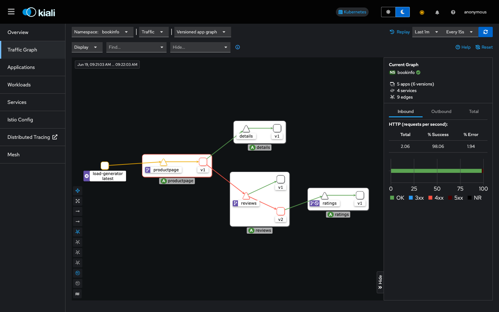
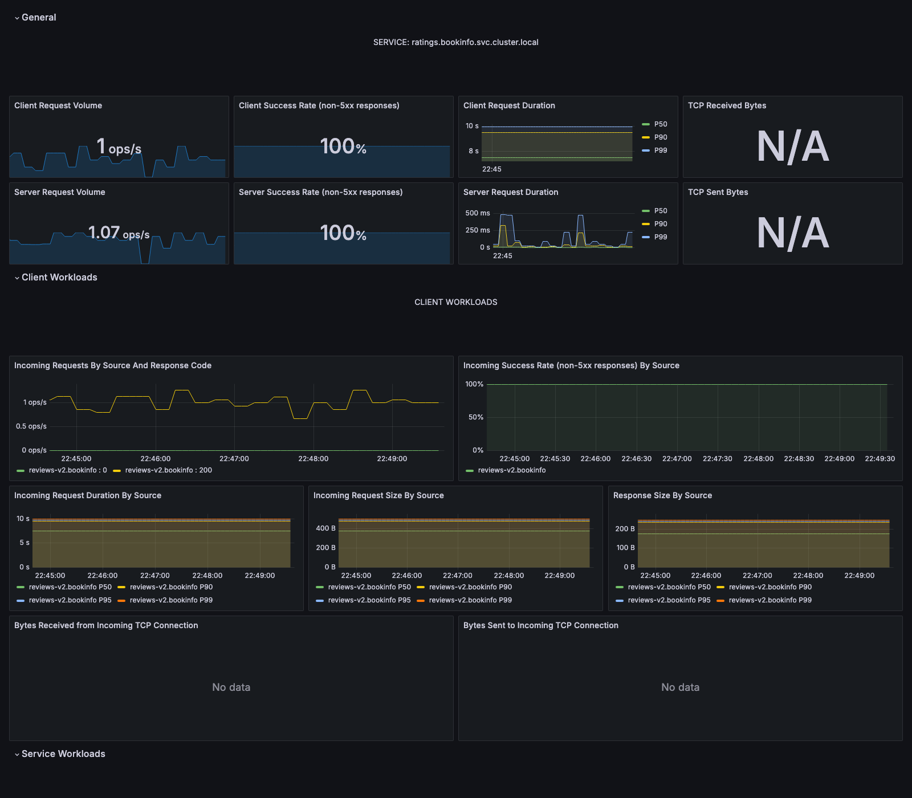
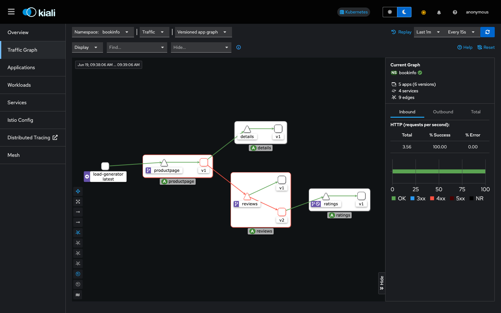
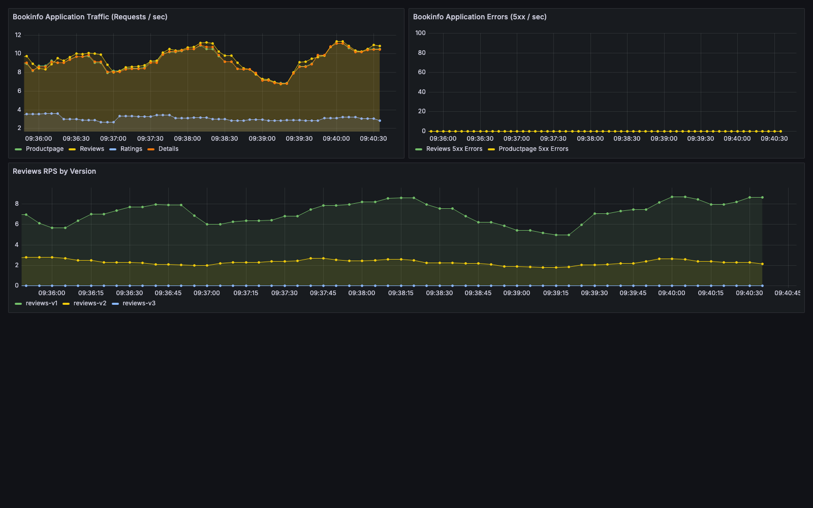
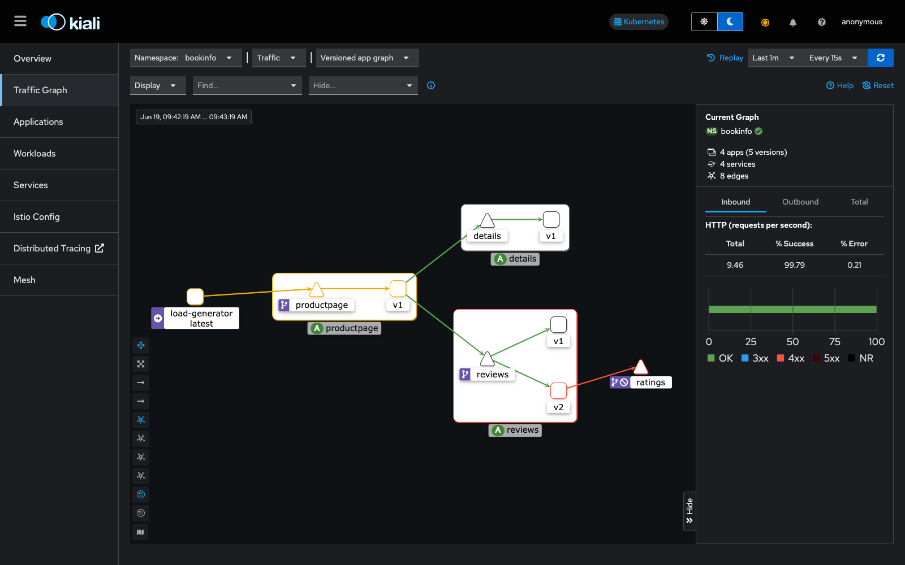
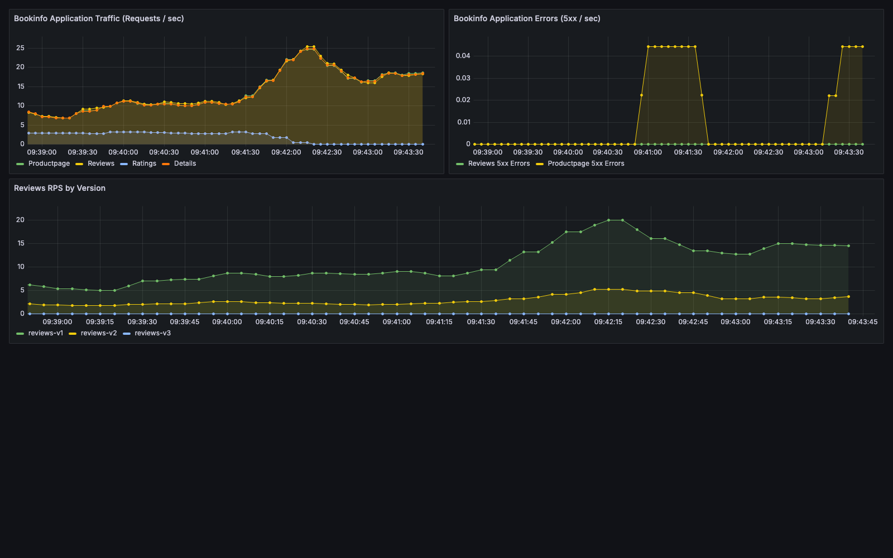
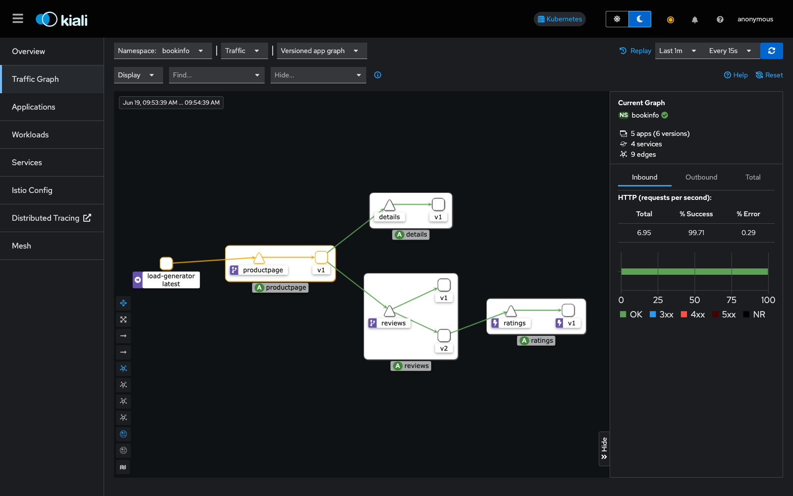
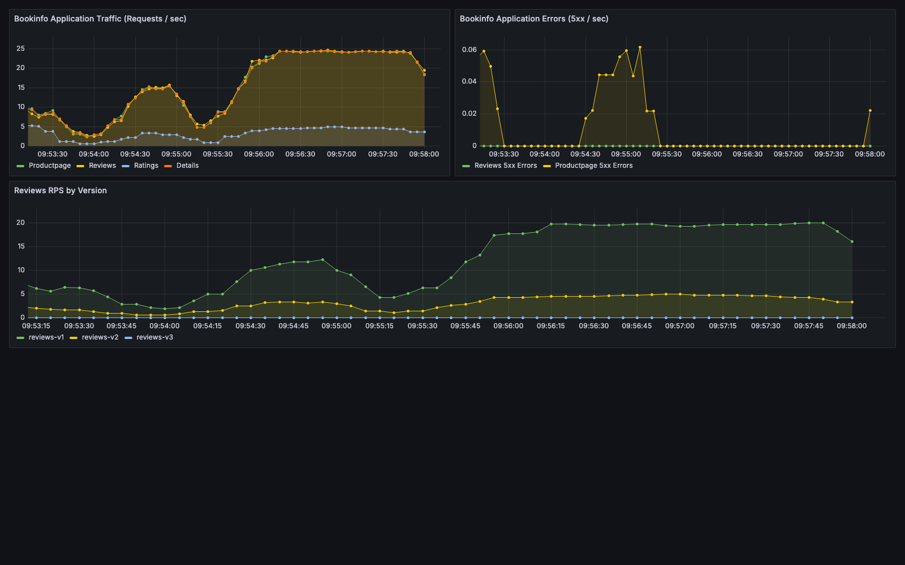

# Fault Injection and Resiliency in Bookinfo

This document describes the fault injection and resiliency rules applied to the
Bookinfo application: latency injection, abort injection, and circuit breaking on the
`ratings` service.

## Setup Steps

1. **Start the cluster and deploy Bookinfo** (skip if already running):
   ```bash
   ./scripts/01-create-cluster.sh
   ./scripts/02-install-istio.sh
   ./scripts/03-deploy-bookinfo.sh
   ./scripts/06-install-metrics.sh
   ./scripts/07-install-tracing.sh
   ```
2. **Run the load generator** so the effect of each fault is visible in Kiali/Grafana:
   ```bash
   ./scripts/08-start-load-generator.sh
   ```

## 1. Header-based latency injection (100 % of `jason` traffic)

[`networking/virtual-service-ratings-test-delay.yaml`](../networking/virtual-service-ratings-test-delay.yaml)
injects a fixed 7 s delay into every request to `ratings` that carries the header
`end-user: jason`. All other traffic is routed to `ratings:v1` with no delay.

```yaml
fault:
  delay:
    percentage:
      value: 100.0
    fixedDelay: 7s
```

```bash
kubectl apply -n bookinfo -f networking/virtual-service-reviews-test-v2.yaml
kubectl apply -n bookinfo -f networking/virtual-service-ratings-test-delay.yaml
bash scripts/13-test-latency-fault.sh
```

`13-test-latency-fault.sh` confirms that anonymous traffic still returns in under 2 s,
while requests as `jason` take at least 5.5 s and surface a degraded ("reviews
unavailable") response once the 3 s `productpage` timeout (see §4) is exhausted.





## 2. Percentage-based latency injection (50 % of all `ratings` traffic)

[`networking/virtual-service-ratings-test-delay-50-percent.yaml`](../networking/virtual-service-ratings-test-delay-50-percent.yaml)
removes the header match and instead injects the same 7 s delay into a random 50 % of
**all** traffic reaching `ratings`, independent of which user is making the request —
this is the partial-failure simulation used to validate graceful degradation under
load rather than a single-user edge case.

```yaml
fault:
  delay:
    percentage:
      value: 50.0
    fixedDelay: 7s
```

```bash
kubectl apply -n bookinfo -f networking/virtual-service-ratings-test-delay-50-percent.yaml
bash scripts/14-test-percentage-fault.sh
```

`14-test-percentage-fault.sh` drives a 60 s, 4-thread load test against `productpage`
and records the elapsed time of every request to
`logs/14-latency-fault-percentage.csv`. The resulting latency distribution clusters
into three groups — roughly 0 s (no delayed dependency on the path), ~3 s (one delayed
hop), and ~6 s (both `reviews` and `ratings` hops delayed) — and the script asserts the
observed delayed-request rate is within ±15 % of the configured 50 %.





## 3. Abort injection (100 % of `jason` traffic)

[`networking/virtual-service-ratings-test-abort.yaml`](../networking/virtual-service-ratings-test-abort.yaml)
returns an immediate HTTP 500 for every request to `ratings` from `jason`, without
adding any latency — simulating a hard dependency failure instead of a slow one.

```yaml
fault:
  abort:
    percentage:
      value: 100.0
    httpStatus: 500
```

```bash
kubectl apply -n bookinfo -f networking/virtual-service-ratings-test-abort.yaml
```

In the Kiali graph below, the `ratings` node and the inbound edge from `reviews:v2`
turn red, reflecting the 500s served to the `jason` cohort while the rest of the mesh
stays healthy.





## 4. Timeout and retry configuration

[`networking/virtual-service-reviews-timeout-3s.yaml`](../networking/virtual-service-reviews-timeout-3s.yaml)
bounds every call to `reviews` with a 3 s overall timeout and up to 3 retries
(`perTryTimeout: 2s`, `retryOn: 5xx`), so `productpage` degrades gracefully — rendering
the page without ratings — instead of hanging indefinitely when a downstream fault is
active.

```bash
kubectl apply -n bookinfo -f networking/virtual-service-reviews-timeout-3s.yaml
python scripts/15-test-retry-mechanism.py
```

`15-test-retry-mechanism.py` reapplies the abort fault from §3 and confirms the retry
policy measurably improves the success rate compared to a single attempt.

## 5. Circuit breaker on `ratings`

[`networking/destination-rule-ratings-circuit-breaker.yaml`](../networking/destination-rule-ratings-circuit-breaker.yaml)
caps `ratings` to a single TCP connection and a single pending HTTP request, and ejects
any instance for 3 minutes after just one 5xx response:

```yaml
trafficPolicy:
  connectionPool:
    tcp:
      maxConnections: 1
    http:
      http1MaxPendingRequests: 1
      maxRequestsPerConnection: 1
  outlierDetection:
    consecutive5xxErrors: 1
    interval: 1s
    baseEjectionTime: 3m
    maxEjectionPercent: 100
```

```bash
kubectl apply -n bookinfo -f networking/destination-rule-ratings-circuit-breaker.yaml
bash scripts/16-test-circuit-breaker.sh
```

`16-test-circuit-breaker.sh` deploys a `fortio` load-testing pod and fires 20 concurrent
connections at `ratings`, then checks that Envoy's `upstream_rq_pending_overflow`
counter increases — proof the breaker is rejecting requests instead of queueing them.
In the capture below, a sustained fortio run at `-c 20` against `ratings` produced a
98.9 % HTTP 503 rate, and Kiali marks `ratings` with the circuit-breaker (lightning
bolt) badge.





## Removing the faults

```bash
kubectl -n bookinfo delete -f networking/virtual-service-ratings-test-delay.yaml --ignore-not-found
kubectl -n bookinfo delete -f networking/virtual-service-ratings-test-delay-50-percent.yaml --ignore-not-found
kubectl -n bookinfo delete -f networking/virtual-service-ratings-test-abort.yaml --ignore-not-found
kubectl apply -n bookinfo -f networking/destination-rule-all.yaml
```
