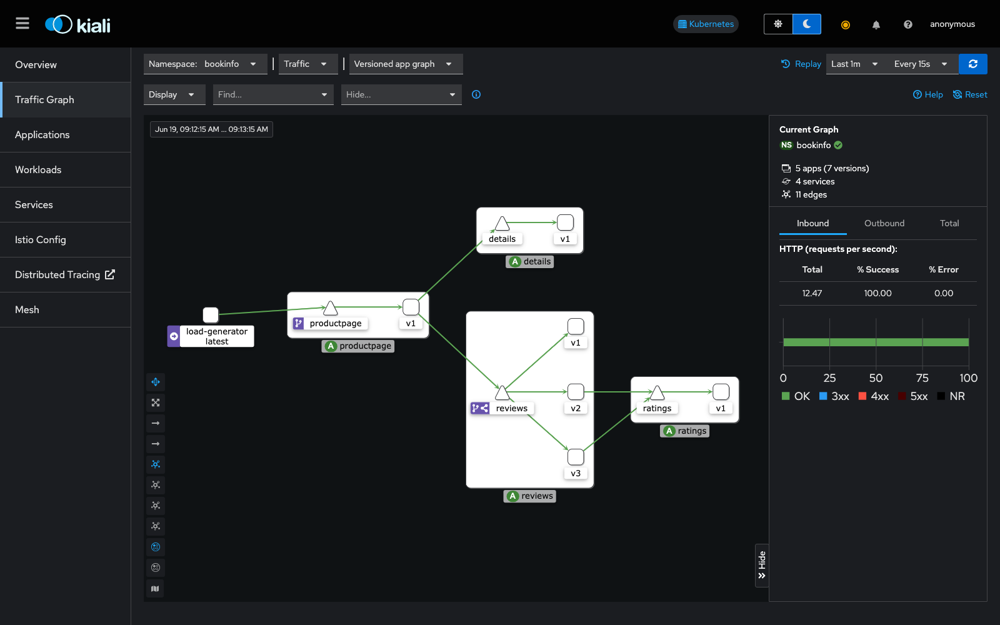
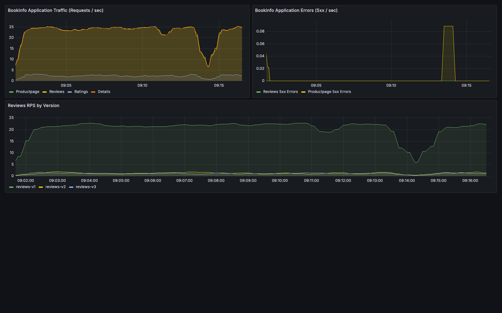
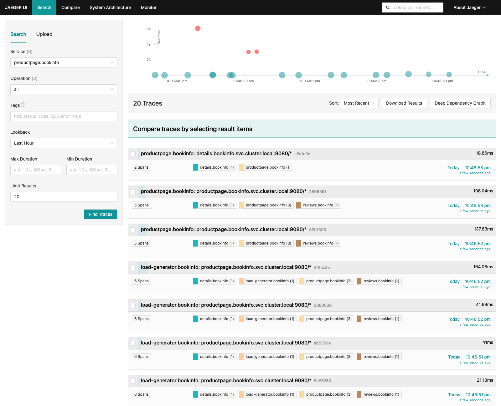
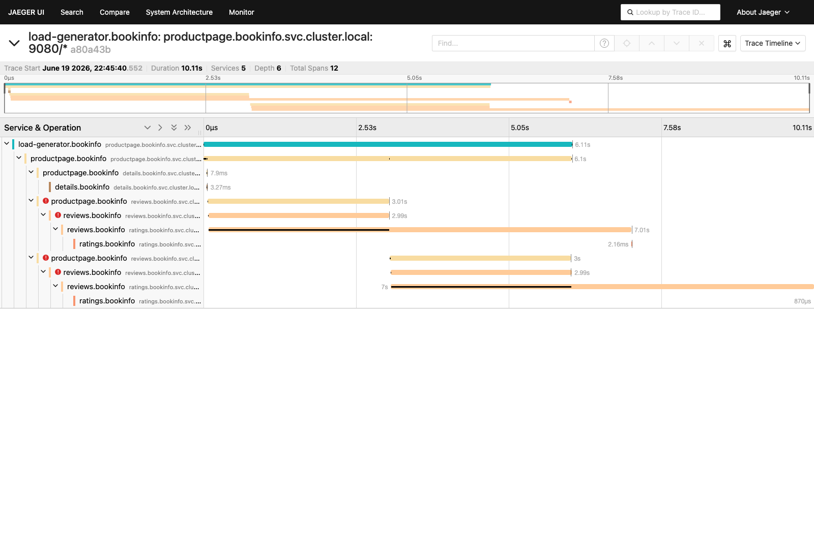

# Observability: Kiali, Grafana, and Jaeger

This document covers the three observability tools installed alongside the mesh —
Kiali for service topology, Grafana for metrics dashboards, and Jaeger for distributed
tracing — corresponding to the Week 3–4 objective in the
[Project Proposal](ProjectProposal.md).

## Setup Steps

```bash
./scripts/01-create-cluster.sh
./scripts/02-install-istio.sh
./scripts/03-deploy-bookinfo.sh
./scripts/06-install-metrics.sh   # Prometheus + Grafana
./scripts/07-install-tracing.sh   # Jaeger + Kiali + 100% sampling Telemetry
./scripts/08-start-load-generator.sh
```

Access each UI with:

```bash
kubectl -n kiali port-forward svc/kiali 20001:20001      # http://localhost:20001/kiali
kubectl -n istio-system port-forward svc/grafana 3000:3000  # http://localhost:3000
kubectl -n jaeger port-forward svc/tracing 16686:80       # http://localhost:16686/jaeger
```

## Kiali: service topology

Kiali's traffic graph renders the live Bookinfo topology — `productpage → reviews →
ratings`/`details` — with per-edge request rates and success percentages, refreshed
from Prometheus every 15 s. The capture below shows the mesh under the canary routing
scenario from [TrafficEngineering.md](TrafficEngineering.md), with `reviews` split
across `v1`/`v2`/`v3`:



The **Istio Config** view lists every Istio CRD applied to a namespace (VirtualService,
DestinationRule, Gateway, PeerAuthentication, AuthorizationPolicy, Telemetry) with a
validation status — used throughout [FaultInjection.md](FaultInjection.md) and
[SecurityPolicies.md](SecurityPolicies.md) to confirm configuration was accepted:


## Grafana: metrics dashboards

`06-install-metrics.sh` installs Prometheus plus a custom **Bookinfo** Grafana
dashboard (`metrics/`) with three panels: application traffic (req/s per service),
application errors (5xx/s), and per-version `reviews` request rate — the same panels
used to evidence each fault injection scenario:



The standard Istio addon dashboards (Istio Mesh, Istio Service, Istio Control Plane)
are also installed and queryable at `http://localhost:3000/dashboards`.

## Jaeger: distributed tracing

`07-install-tracing.sh` installs a single-binary Jaeger (Badger storage) and applies
[`tracing/telemetry-bookinfo.yaml`](../tracing/telemetry-bookinfo.yaml), a `Telemetry`
resource that sets trace sampling to 100 % for the `bookinfo` namespace so every
request produces a trace instead of the Istio default 1 %.

Bookinfo's services propagate the W3C/B3 tracing headers from each incoming request
onto their own outbound calls (`getForwardHeaders()` in `productpage.py`, the
`headers_to_propagate` list in `LibertyRestEndpoint.java` for `reviews`), so a single
trace connects every hop. The search view below lists requests entering at
`productpage`, each fanning out to `details` and `reviews` (and `reviews` on to
`ratings`):



The waterfall view for one trace shows the full call tree —
`load-generator → productpage → {details, reviews → ratings}` — across 5 services and
12 spans, with per-span timing. This capture was taken while the `jason` latency fault
from [FaultInjection.md](FaultInjection.md) §1 was still active, which is why two of the
`reviews → ratings` spans show a 7 s duration and the parent spans are flagged with an
error icon — Jaeger doubles as a way to pinpoint exactly which downstream call is
responsible for a slow or failed request:



## Removing the observability stack

```bash
kubectl delete namespace kiali jaeger
kubectl -n istio-system delete -f metrics/
```
