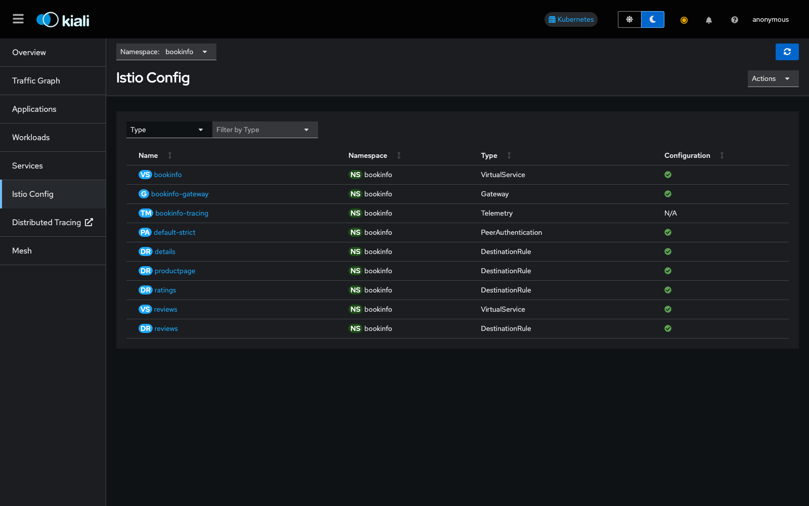
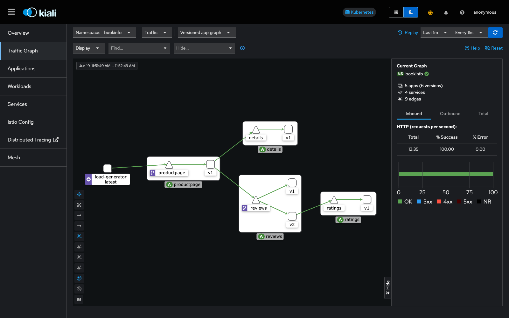
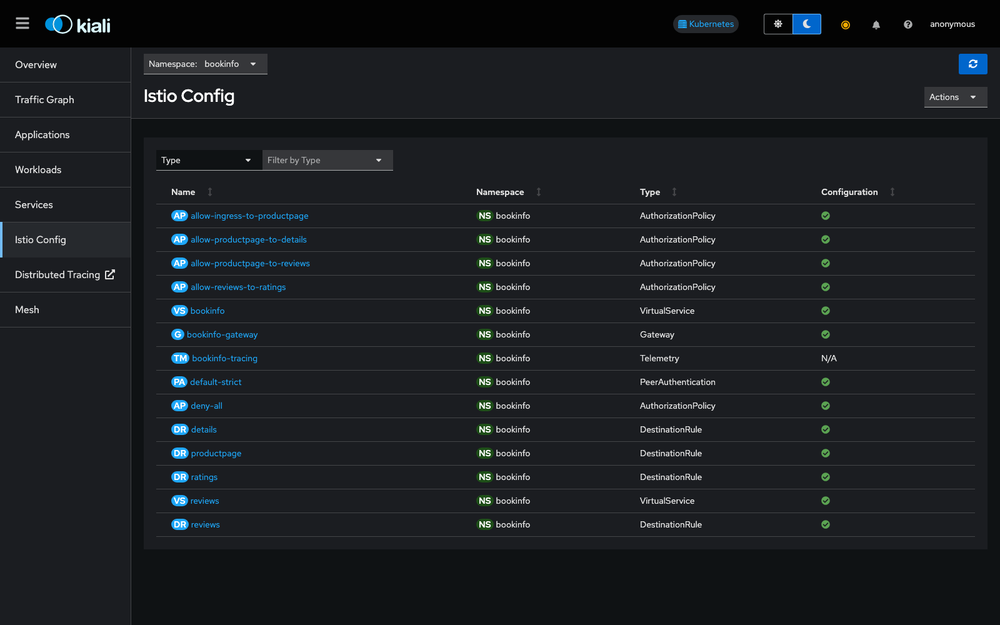

# Zero-Trust Security in Bookinfo

This document covers the security policies applied to the mesh: strict mutual TLS
between all Bookinfo sidecars, a deny-all-by-default `AuthorizationPolicy` model with
granular allow rules per service hop, and ingress-level rate limiting.

## Setup Steps

```bash
./scripts/01-create-cluster.sh
./scripts/02-install-istio.sh
./scripts/03-deploy-bookinfo.sh
./scripts/06-install-metrics.sh
./scripts/07-install-tracing.sh
```

## 1. Strict mutual TLS

[`policy/peer-authentication-strict.yaml`](../policy/peer-authentication-strict.yaml)
applies a namespace-wide `PeerAuthentication` that requires mTLS on every
sidecar-to-sidecar connection in `bookinfo`:

```yaml
apiVersion: security.istio.io/v1
kind: PeerAuthentication
metadata:
  name: default-strict
spec:
  mtls:
    mode: STRICT
```

```bash
kubectl apply -f policy/peer-authentication-strict.yaml -n bookinfo
bash scripts/17-test-mtls.sh
```

`17-test-mtls.sh` deploys a `sleep` pod with no Istio sidecar in the `default`
namespace and one with a sidecar in `bookinfo`. It confirms a plaintext request to
`productpage` from the unmeshed pod is rejected, while the same request from inside
the mesh succeeds — proving STRICT mode is enforced without breaking in-mesh traffic.
[`scripts/18-test-external-mtls.sh`](../scripts/18-test-external-mtls.sh) separately
confirms that external traffic through the Istio ingress gateway is unaffected: the
gateway terminates plaintext from outside the mesh and upgrades it to mTLS internally.

The Kiali **Istio Config** view confirms the `default-strict` `PeerAuthentication` is
active in `bookinfo` alongside the routing resources from the other docs:





## 2. Authorization policies (deny-all + granular allow)

The authorization model starts from
[`policy/authorization-policy-deny-all.yaml`](../policy/authorization-policy-deny-all.yaml) —
an empty-spec `AuthorizationPolicy` that denies all traffic in the namespace by
default — and then layers four `ALLOW` policies, one per legitimate hop, each scoped to
a specific source identity (`principals`) and destination port:

| Policy | Allows | Source principal |
|---|---|---|
| [`allow-ingress-to-productpage.yaml`](../policy/authorization-policy-allow-ingress-to-productpage.yaml) | ingress gateway → `productpage` | `istio-ingressgateway-service-account` |
| [`allow-productpage-to-details.yaml`](../policy/authorization-policy-allow-productpage-to-details.yaml) | `productpage` → `details` | `bookinfo-productpage` |
| [`allow-productpage-to-reviews.yaml`](../policy/authorization-policy-allow-productpage-to-reviews.yaml) | `productpage` → `reviews` | `bookinfo-productpage` |
| [`allow-reviews-to-ratings.yaml`](../policy/authorization-policy-allow-reviews-to-ratings.yaml) | `reviews` → `ratings` | `bookinfo-reviews` |

Example (`productpage` → `reviews`):

```yaml
apiVersion: security.istio.io/v1
kind: AuthorizationPolicy
metadata:
  name: allow-productpage-to-reviews
spec:
  selector:
    matchLabels:
      app: reviews
  action: ALLOW
  rules:
  - from:
    - source:
        principals: ["cluster.local/ns/bookinfo/sa/bookinfo-productpage"]
    to:
    - operation:
        ports: ["9080"]
```

Any hop not explicitly listed — e.g. `productpage` → `ratings` directly, or `details` →
`reviews` — is rejected with HTTP 403 by the deny-all baseline.

```bash
bash scripts/19-test-authz-policies.sh
```

`19-test-authz-policies.sh` applies all five policies, then deploys short-lived client
pods that impersonate each service's identity via `serviceAccountName` (so the
mTLS-derived principal matches what the policies check) and asserts:

- `productpage → reviews`, `productpage → details`, `reviews → ratings`: **allowed** (200)
- `ratings → reviews`, `productpage → ratings`, `details → reviews`: **denied** (403)
- Ingress → `productpage` still renders the full page end to end

The Kiali **Istio Config** view lists all five `AuthorizationPolicy` resources next to
the routing and mTLS configuration already applied:



## 3. Ingress rate limiting

[`policy/productpage_envoy_ratelimit.yaml`](../policy/productpage_envoy_ratelimit.yaml)
is an `EnvoyFilter` pair applied to the `istio-ingressgateway` workload. The first
filter inserts Envoy's rate-limit HTTP filter in front of the router and points it at a
gRPC rate-limit service (domain `productpage-ratelimit`, `failure_mode_deny: true` so
the gateway fails closed if the rate-limit service is unreachable); the second merges a
`:path`-keyed rate-limit descriptor into the gateway's virtual host so limits can be
applied per route.

```bash
kubectl apply -f policy/productpage_envoy_ratelimit.yaml
```

This filter assumes a running rate-limit service (`ratelimit.default.svc.cluster.local:8081`)
implementing the Envoy `RateLimitService` gRPC API; it is included here as the
project's reference configuration for ingress-level throttling rather than a
continuously-running part of the default `run-all.sh` flow.

## Removing the policies

```bash
kubectl -n bookinfo delete -f policy/authorization-policy-deny-all.yaml --ignore-not-found
kubectl -n bookinfo delete -f policy/authorization-policy-allow-ingress-to-productpage.yaml --ignore-not-found
kubectl -n bookinfo delete -f policy/authorization-policy-allow-productpage-to-details.yaml --ignore-not-found
kubectl -n bookinfo delete -f policy/authorization-policy-allow-productpage-to-reviews.yaml --ignore-not-found
kubectl -n bookinfo delete -f policy/authorization-policy-allow-reviews-to-ratings.yaml --ignore-not-found
kubectl -n bookinfo delete -f policy/peer-authentication-strict.yaml --ignore-not-found
```
