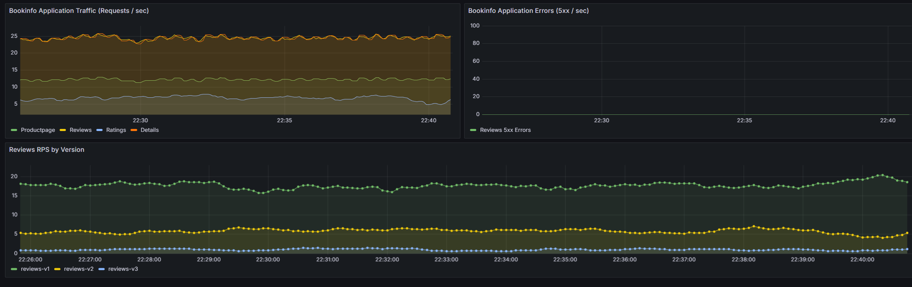
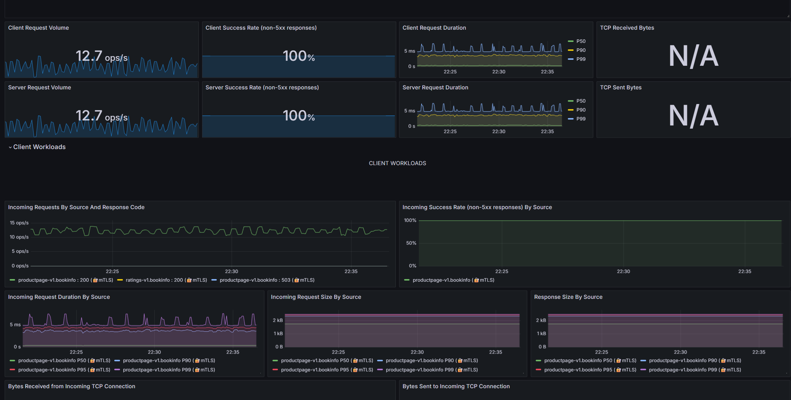

# Traffic Engineering in Bookinfo

This document describes the traffic engineering setup and routing rules applied to the Bookinfo application, including the combination of canary releases and header-based routing.

## Setup Steps

To run the rules and observe traffic, follow these steps:

1. **Start the Cluster and Deploy Bookinfo:**
   ```bash
   ./scripts/01-create-cluster.sh
   ./scripts/02-install-istio.sh
   ./scripts/03-deploy-bookinfo.sh
   ```

2. **Apply the Routing Rules:**
   Apply the combined virtual service and destination rules:
   ```bash
   kubectl apply -f networking/destination-rules.yaml
   kubectl apply -f networking/combined-virtual-service.yaml
   ```

3. **Install Metrics and Tracing:**
   ```bash
   ./scripts/06-install-metrics.sh
   ./scripts/07-install-tracing.sh
   ```

4. **Run the Load Generator:**
   Simulate realistic traffic that mixes normal requests and requests with a specific header (`end-user: jason`).
   ```bash
   python scripts/load-generator.py --header-rate 0.2
   ```

5. **Query the Metrics:**
   You can validate the metrics by querying Prometheus automatically:
   ```bash
   ./scripts/12-query-metrics.sh
   ```

## Traffic Split and Header Routing

The `reviews-combined` VirtualService implements a dual-routing strategy:
- Requests containing the header `end-user: jason` are routed **100% to v2**.
- All other requests follow a **Canary Split**: 90% to `v1`, 5% to `v2`, and 5% to `v3`.

### Kiali Dashboard
The Kiali dashboard gives a graphical node layout representing the service mesh traffic. Under load, it visualizes the split according to the defined weights and header-based paths.



### Grafana Dashboard
The Grafana dashboard visualizes request volume, success rate, and P99 latency. With the load generator running, you can observe spikes and stable metrics over time.


